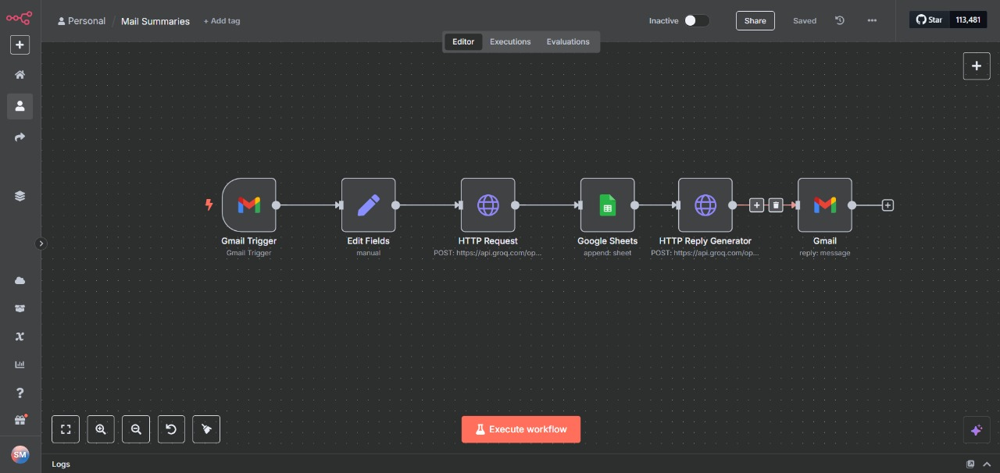
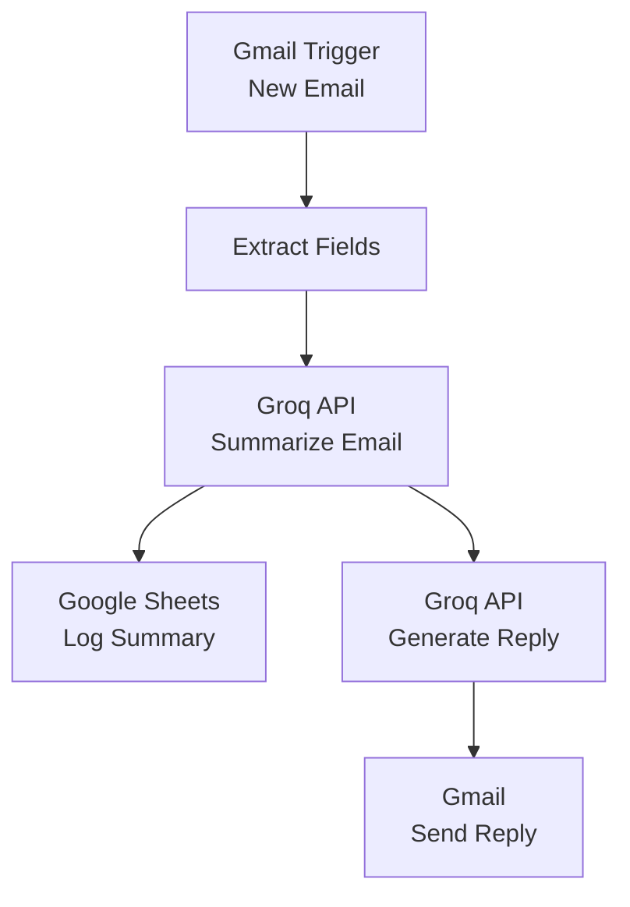

# AI Powered Autonomous Email Agent 
**_Read, understand, and professionally reply to emails — all without human intervention._**

---

<div align="center">
  
</div>

---

## 🚀 What is This?

A **zero-code, AI-powered email assistant** powered by [n8n](https://n8n.io/):

- 📨 **Reads** your new Gmail messages
- 🧠 **Summarizes** them with blazing-fast [Groq API](https://groq.com/) (LLaMA3-70B)
- 📊 **Logs** each summary in **Google Sheets**
- ✍️ **Auto-generates** professional replies (ready to send!)
- 📤 **Sends** the reply back via Gmail

---

## 🗺️ Workflow at a Glance



---

## 🛠️ Tech Stack

| Tool             | Purpose                                  |
|------------------|------------------------------------------|
| [n8n](https://n8n.io/)            | Workflow automation                |
| [Groq API](https://groq.com/)     | Lightning-fast LLaMA3 summarization & reply |
| Gmail API        | Inbox read/send automation                |
| Google Sheets API| Structured summary logging                |

---

## 📁 Project Structure

| File             | Description                              |
|------------------|------------------------------------------|
| `workflow.json`  | Full n8n workflow export                 |
| `workflow.jpg`   | Workflow canvas screenshot               |
| `README.md`      | This file!                               |

---

## ⚡ Quickstart Guide

1. **Clone This Repo**

   ```bash
   git clone https://github.com/sourabhm-25/mail-summaries-agent.git
   cd mail-summaries-agent
   ```

2. **Import the Workflow into n8n**

   - Open n8n (cloud/self-hosted)
   - Go to **Workflows → Import from File**
   - Select `workflow.json`

3. **Configure Your Credentials**

   - **Gmail**: Connect your Gmail (OAuth2)
   - **Google Sheets**: Link your Sheets account
   - **Groq API**: Paste your API key as a credential

     ```
     Bearer GROP-CLOUD_API_KEY
     ```

4. **Set Your Google Sheet**

   - In the workflow, replace `SHEET_ID_HERE` with your own Sheet ID

5. **🚦 Activate the Workflow**

   - Toggle the workflow **ON**  
   - Enjoy hands-free, AI-powered inbox management!

---

## 📊 Google Sheets Output Example

| Date       | From                 | Subject        | Summary                       |
|------------|----------------------|----------------|-------------------------------|
| 2025-09-10 | test@example.com     | Meeting Update | "Meeting rescheduled to 3 PM" |

---

## 🤖 Sample Auto-Reply

> Thank you for your email.  
> I acknowledge the updated meeting schedule and will be available at the mentioned time.  
>  
> Best regards,  
> Sourabh

---

## 🌟 Why Use This?

- **Save time** — instant summaries and replies, no context switching
- **Stay organized** — searchable log in Google Sheets
- **Feel empowered** — professional, AI-crafted communications

---

<div align="center">
  <strong>✨ Ready to supercharge your inbox? Fork, clone, and automate away! ✨</strong>
</div>
